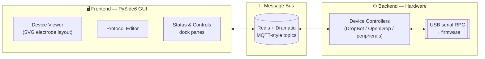

<p align="center">
  
</p>

<h1 align="center">MicroDrop</h1>

<p align="center">
  <a href="#"></a>
  <a href="LICENSE"></a>
  <a href="https://prefix.dev/channels/microdrop-plugins"></a>
</p>

<p align="center">
  A modern, plugin-based control application for <b>digital microfluidics (DMF)</b> —
  drive <a href="https://sci-bots.com/products/dropbot">DropBot</a> and
  <a href="https://www.gaudi.ch/OpenDrop/">OpenDrop</a> hardware from an interactive
  device viewer, build droplet-handling protocols, and extend it all with plugins.
</p>

---

## Table of Contents

- [What is MicroDrop?](#what-is-microdrop)
- [Getting Started](#getting-started)
- [Running the Application](#running-the-application)
- [Remote / Distributed Operation](#remote--distributed-operation)
- [Architecture](#architecture)
- [Plugins](#plugins)
- [Developer Workflow](#developer-workflow)
- [Disclaimer & License](#disclaimer--license)

## What is MicroDrop?

MicroDrop is the next generation of the open-source MicroDrop application by
[Sci-Bots](https://sci-bots.com/): a graphical user interface for **digital
microfluidics** control systems, which move tiny droplets across an electrode
array using electric fields — lab-on-a-chip for biology, chemistry, and
diagnostics.

Highlights:

- 🧪 **Interactive device viewer** — click electrodes on an SVG chip layout to
  actuate them, watch droplets move with live capacitance feedback
- 📋 **Protocol editor** — compose, run, and repeat multi-step droplet
  protocols
- 🔌 **Everything is a plugin** — built on the
  [Envisage](https://docs.enthought.com/envisage/) framework; peripherals
  (heater, magnet, fluorescence imaging) ship as separate installable plugins
- 🌐 **Fully decoupled frontend/backend** — GUI and hardware controller talk
  over a Redis message bus, so they can run on the same machine or across a
  network
- 🖥️ **Cross-platform** — Windows, Linux, and macOS

Supported hardware:

| Platform | Description |
|---|---|
| [DropBot](https://sci-bots.com/products/dropbot) | Sci-Bots' DMF platform — full capacitance sensing, short detection, multi-channel actuation |
| [OpenDrop](https://www.gaudi.ch/OpenDrop/) | Open-source DMF platform by GaudiLabs |
| Mock device | No hardware needed — for development and demos |

## Getting Started

There are three ways to get MicroDrop running, from easiest to most manual.

### Option 1 — MicroDrop Launcher (recommended)

The one-file setup & launcher lives in the
[pixi-microdrop](https://github.com/Blue-Ocean-Technologies-Inc/pixi-microdrop)
repo: [`microdrop_setup.py`](https://github.com/Blue-Ocean-Technologies-Inc/pixi-microdrop/blob/master/microdrop_setup.py).
It needs only a standard Python installation (stdlib only) and takes care of
everything else:

- installs [pixi](https://pixi.sh) and clones the project if needed, then
  prefetches the environment
- lets you configure **launch profiles** — device (DropBot / OpenDrop / mock),
  mode (full app / frontend-only / backend-only), optional plugins, Redis
  host/port
- creates **desktop shortcuts** that launch a saved profile directly
- keeps the repos updated on launch (configurable)

```bash
# download microdrop_setup.py, then:
python microdrop_setup.py
```

### Option 2 — pixi-microdrop (developers)

[pixi-microdrop](https://github.com/Blue-Ocean-Technologies-Inc/pixi-microdrop)
wraps this repo as a submodule inside a reproducible
[pixi](https://pixi.sh) environment — no manual dependency management, and the
plugin repos are cloned alongside for editable installs:

```bash
git clone --recursive https://github.com/Blue-Ocean-Technologies-Inc/pixi-microdrop
cd pixi-microdrop/microdrop-py
pixi run microdrop
```

Other useful tasks: `pixi run microdrop-frontend`, `pixi run
microdrop-backend`, `pixi run opendrop-microdrop`, `pixi run run_redis`,
`pixi run setup-hooks` (see [Developer Workflow](#developer-workflow)).

### Option 3 — Manual (conda)

Requires **Python 3.12** and a running Redis server.

```bash
conda env create -f environment.yml
# start Redis (either works):
redis-server                              # plain terminal
python examples/start_redis_server.py     # bundled helper
```

## Running the Application

Redis must be running first (pixi runs handle this for you). The combined
launcher `examples/run_device_viewer_pluggable.py` can load any combination of
plugin layers via `--plugins`, so a single script covers full-app,
frontend-only, or backend-only runs:

```bash
# Full app — frontend + backend (the default)
python examples/run_device_viewer_pluggable.py

# Frontend (GUI) only — needs Redis + a backend running separately
python examples/run_device_viewer_pluggable.py --plugins frontend

# Backend only — persistent headless process, connects to an existing Redis
python examples/run_device_viewer_pluggable.py --plugins backend

# Any combination, with a device selection
python examples/run_device_viewer_pluggable.py --plugins backend services --device mock
```

`--plugins` accepts one or more space-separated values from `frontend`,
`backend`, and `services`, defaulting to `frontend backend`:

- **Services** (e.g. SSH controls) are trust-bound to the GUI host, so they
  load automatically with `frontend`, or on explicit `services` request.
- Selecting `frontend` runs the GUI application; a backend-only selection runs
  the persistent headless backend application.
- The **frontend host owns the Redis server**; a backend-only run instead
  connects to an already-running Redis (use this for a remote backend host).

`--device` selects the hardware target (`dropbot`, `opendrop`, or `mock`;
default `dropbot`) and pulls in the matching device-specific plugins.

## Remote / Distributed Operation

Because all communication flows through Redis, the GUI and the hardware
controller don't have to share a machine.

**Server side (the machine wired to the hardware):**

1. Ensure a Redis server is reachable (it can run anywhere — not necessarily
   on this machine).
2. Run the backend: `pixi run microdrop-backend`

**Client side (your local machine):**

- GUI: `pixi run microdrop-frontend`
- Headless: publish commands directly with `publish_message(message, topic)`

**Redis configuration:**

- On the Redis host: bind to the correct network adapter in `redis.conf` and
  disable protected mode if applicable, so external connections are accepted.
- On each client: copy
  [redis_settings.example.json](redis_settings.example.json) to
  `redis_settings.json` and set the host/port to the Redis server's.

## Architecture

MicroDrop is a three-layer, message-driven system — the GUI, the message bus,
and the hardware backend are fully decoupled:



A click on an electrode publishes a state-change message; Redis routes it to a
backend worker, which translates it into a serial RPC call to the firmware;
capacitance feedback flows back the same way to update the GUI. Plugins never
call each other directly — every interaction is a published message.

**📽️ Want the full tour?** The interactive
[**MicroDrop Architecture presentation**](user_help_plugin/resources/microdrop-architecture.html)
walks through the three-layer design, the plugin system, the message bus, and
the DropBot API with diagrams and code examples. It's also available inside
the app under **Help → MicroDrop Architecture**, or
[viewable in your browser](https://raw.githack.com/Blue-Ocean-Technologies-Inc/Microdrop/main/user_help_plugin/resources/microdrop-architecture.html).

Deeper reference docs:

| Document | What's inside |
|---|---|
| [MESSAGES.md](MESSAGES.md) | Complete pub/sub topic map — who sends and receives what |
| [docs/ENVISAGE_TRAITS_GUIDE.md](docs/ENVISAGE_TRAITS_GUIDE.md) | Envisage / Traits / TraitsUI guide and how this repo uses them |
| [docs/PLUGIN_DEVELOPMENT.md](docs/PLUGIN_DEVELOPMENT.md) | How to build a MicroDrop plugin |
| [DRAMATIQ_DOCS.md](DRAMATIQ_DOCS.md) | Dramatiq broker / encoder / actor notes |
| [docs/DESIGN_HISTORY.md](docs/DESIGN_HISTORY.md) | Pre-development research & why Envisage / Redis / Dramatiq were chosen |

## Plugins

Every major feature is an Envisage plugin — the device viewer, protocol
editor, status panes, and hardware controllers alike. Optional peripheral
plugin groups can be toggled at runtime via **Tools → Peripherals**, no
restart required.

Peripheral plugins live in their own repos and are published as conda packages
to [prefix.dev/microdrop-plugins](https://prefix.dev/channels/microdrop-plugins):

| Plugin | Repo | What it does |
|---|---|---|
| 🌡️ Heater | [heater-microdrop-plugin-py](https://github.com/Blue-Ocean-Technologies-Inc/heater-microdrop-plugin-py) | Multi-channel heater/TEC control with PID loops, live telemetry plots, sensor configuration, and firmware upload |
| 🧲 Magnet | [magnet-microdrop-plugin-py](https://github.com/Blue-Ocean-Technologies-Inc/magnet-microdrop-plugin-py) | Magnet engage/disengage control for bead-based protocols |
| 🔬 Fluorescence | [fluorescence-microdrop-plugin-py](https://github.com/Blue-Ocean-Technologies-Inc/fluorescence-microdrop-plugin-py) | Fluorescence imaging & measurement (ZWO ASI camera + illumination board) |

Want to write your own? Start with
[docs/PLUGIN_DEVELOPMENT.md](docs/PLUGIN_DEVELOPMENT.md).

## Developer Workflow

### Commit messages (Conventional Commits)

Every commit message must follow the
[Conventional Commits](https://www.conventionalcommits.org/) format — a CI
check ([conventional-commits.yml](.github/workflows/conventional-commits.yml))
runs `cz check` on every PR commit, so non-conforming messages block the
merge. The format matters because releases are derived from it: commitizen
reads the commit history to compute the next version number and generate the
changelog (see [Releases](#releases--changelogmd) below).

```
type(scope): subject

optional body explaining why and what

optional footer (e.g. BREAKING CHANGE: ...)
```

- **Types:** `feat` (new feature → minor bump), `fix` (bug fix → patch bump),
  `refactor`, `perf`, `docs`, `ci`, `chore`, `test`.
- **Scope** is optional but encouraged — use the plugin/package name, e.g.
  `feat(device_viewer): add electrode search`.
- **Breaking changes:** append `!` after the type/scope
  (`feat(api)!: drop legacy topics`) or add a `BREAKING CHANGE:` footer →
  major bump.
- Keep the subject imperative and ~50 characters; put the why/what in the
  body.

Examples:

```
feat(dropbot_controller): add short-detection retry
fix(protocol_grid): preserve step order on paste
docs: add developer workflow section to README
chore: release v1.1.0
```

### Git hooks (setup once per clone)

The repo ships a [pre-commit](https://pre-commit.com/) config
([.pre-commit-config.yaml](.pre-commit-config.yaml)) that enforces the commit
format locally and runs sanity checks on staged files.

**Via [pixi-microdrop](https://github.com/Blue-Ocean-Technologies-Inc/pixi-microdrop)**
(one command, run from the outer `microdrop-py/` directory — installs the
hooks into this repo **and** the heater / magnet / fluorescence plugin
clones):

```bash
pixi run setup-hooks
```

**Without pixi**, install `pre-commit` yourself (e.g. `pipx install
pre-commit`) and run once inside each repo clone:

```bash
pre-commit install --hook-type commit-msg --hook-type pre-commit
```

The hooks that run on every `git commit`:

| Hook | What it does |
|---|---|
| `commitizen` (commit-msg) | Rejects the commit if the message isn't valid Conventional Commits — the local mirror of the CI gate |
| `check-ast` | Staged `.py` files must parse (catches syntax errors before they land) |
| `check-merge-conflict` | Blocks files containing leftover merge-conflict markers |
| `check-added-large-files` | Blocks files larger than 500 kB |
| `forbid-scratch-files` | Blocks scratch/artifact paths (`__pycache__/`, `.pixi/`, …) from ever being committed |

Tips: `pre-commit run --all-files` runs the file hooks over the whole repo. A
failed hook aborts the commit — fix the issue (or the message) and retry. In a
genuine emergency a hook can be bypassed with `git commit --no-verify`, but
the CI check will still fail the PR, so fix the message instead.

If you prefer to be prompted instead of writing the message yourself,
commitizen can compose a conforming message interactively:

```bash
# via pixi-microdrop (no install needed)
pixi exec --spec "commitizen>=4,<5" -- cz commit

# without pixi (after `pipx install "commitizen>=4,<5"`)
cz commit
```

### Releases & CHANGELOG.md

[CHANGELOG.md](CHANGELOG.md) is **generated, never hand-edited**. Commitizen
(configured in [.cz.toml](.cz.toml)) builds it from the Conventional Commit
history:

- The version lives in **git tags only** (`version_provider = "scm"`, tags
  formatted `vX.Y.Z`) — there is no version string in the source to bump.
- `cz bump` looks at all commits since the last `v*` tag, derives the bump
  (`feat` → minor, `fix` → patch, `BREAKING CHANGE`/`!` → major), rewrites
  CHANGELOG.md with sections grouped by type (Feat / Fix / Refactor / …),
  commits it as `chore: release vX.Y.Z`, and creates an annotated tag.
- Commit **scopes** become the bold prefixes in changelog entries
  (e.g. `- **plugin-management**: full Manage Plugins window`), which is why
  meaningful scopes are worth writing.

Cutting a release (maintainers, from an up-to-date `main`):

```bash
# via pixi-microdrop
pixi exec --spec "commitizen>=4,<5" -- cz bump

# without pixi (after `pipx install "commitizen>=4,<5"`)
cz bump

# then, either way (requires branch-protection bypass, i.e. an admin):
git push origin main --follow-tags
```

The **plugin repos** (heater / magnet / fluorescence) release fully
automatically: every push to `main` containing release-worthy conventional
commits bumps the version, regenerates their CHANGELOG.md, publishes the
conda package to `prefix.dev/microdrop-plugins`, and tags — no manual
`cz bump` needed there.

## Disclaimer & License

MicroDrop is an open-source software platform currently in **beta**, provided
for testing and evaluation purposes. It is under active development and may
contain bugs, errors, or unexpected behaviour. Users are responsible for
validating the software in their own workflows and for maintaining
appropriate data backups before, during, and after use.

This software is provided under the
[GNU Affero General Public License v3 (AGPLv3)](LICENSE), without any
warranty. Use at your own risk.
